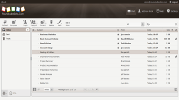
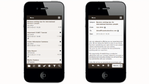

# COFFEE-DESKTOP-MOBILE-ROUNDCUBE-SKINS
This repository holds the source code of Coffeee Desktop and Mobile Roundcube Skins
# How to install
Read the instruction to activate the RoundcubeSkins : [Instructions to Use](../../wiki/ACTIVATION) 

# How do they look #

## Desktop View ##

---

## Mobile View ##

---

We wish you a colorful experience while using the RoundcubeSkins.
